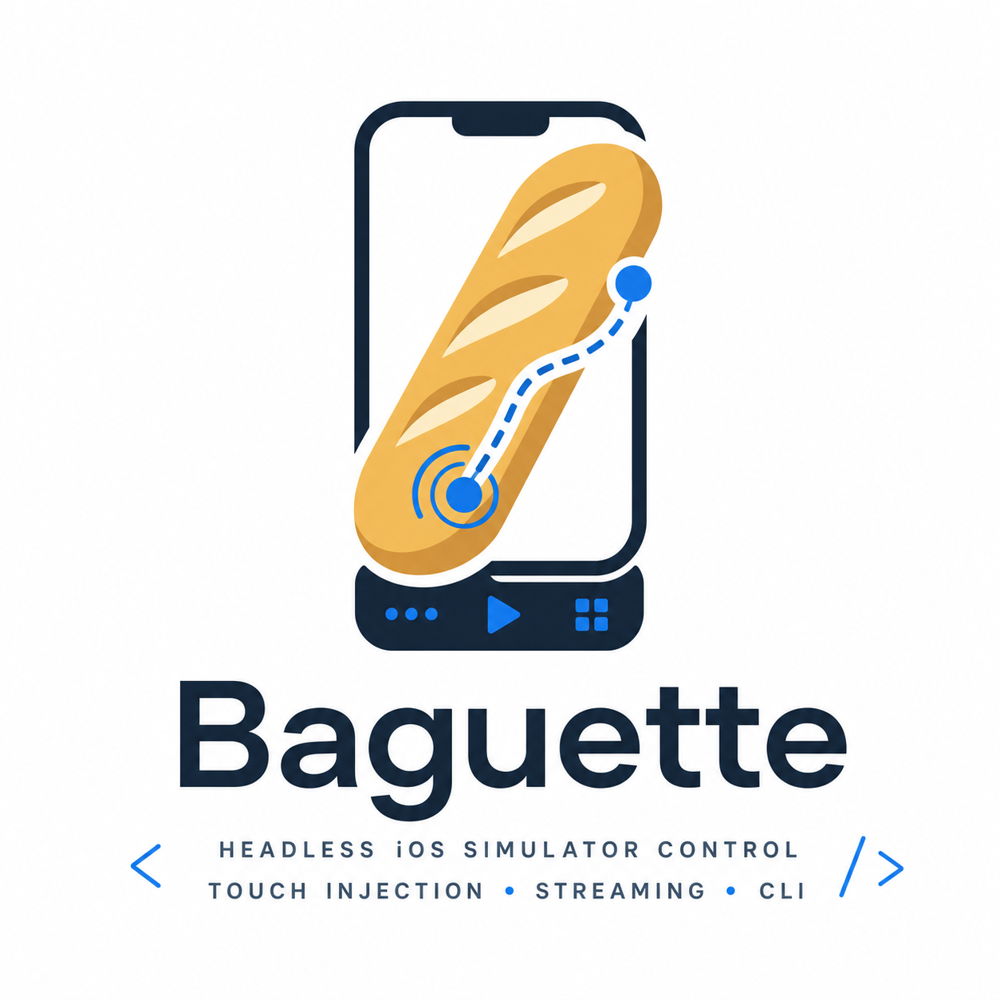

<p align="center">
  
</p>

<h1 align="center">Agent Sim</h1>

<p align="center"><em>Agentic simulator feedback loops for mobile teams.</em></p>

<p align="center">
  Headless iOS Simulator control, screenshot capture, markup, review tasks, and quality gates for Expo and native mobile apps.
</p>

<p align="center">
  <a href="https://github.com/Vinniai/agent-sim/actions/workflows/ci.yml"></a>
  <a href="https://www.npmjs.com/package/agent-sim"></a>
  <a href="https://github.com/Vinniai/agent-sim/releases/latest"></a>
  <a href="LICENSE"></a>
  
  
  
</p>

A single Swift CLI — **`agent-sim`** — that creates / boots / shuts down
simulator devices, streams their screens at 60 fps, and injects taps
/ swipes / multi-finger touches without booting the Simulator.app GUI.
Optionally serves a self-contained web UI on `localhost` so you can
control any booted simulator from a browser. Agent Sim also records
review sessions: screenshots, accessibility trees, markups, source
changes, verification snapshots, and score gates that let an agent run a
self-building feedback loop.

## Use cases

**Drive a booted simulator from an agent or CI — no GUI.**

```bash
agent-sim boot --udid <UDID>
agent-sim describe-ui --udid <UDID> | jq '.[] | select(.label == "Sign in")'
agent-sim tap --udid <UDID> --x 219 --y 478 --width 438 --height 954
agent-sim screenshot --udid <UDID> --output after.jpg
```

`describe-ui` returns each node's `frame` in the same device points `tap`
consumes, so a hit-test result pipes straight back into a gesture.

**Run a self-building review loop.** `agent bootstrap` seeds a review
session plus capture → markup → enhance → verify tasks; an agent drains
the queue, records its work, then closes the loop against the score gate.

```bash
agent-sim agent bootstrap --project ~/app --bundle-id com.acme.app --name "Login polish"
agent-sim review-tasks watch --status open                  # one JSON line per change
agent-sim review-tasks result <task-id> --status done --verify
agent-sim agent quality-gate <task-id> --score 9            # the "8/10+, no highs" gate
```

**Author an acceptance criterion from a live element, then verify against it.**

```bash
agent-sim review-tasks criterion --udid <UDID> --x 219 --y 478
agent-sim review-tasks verify-criteria <task-id> --live --udid <UDID>
```

**Collect human feedback from a phone over Tailscale.** Open `/m/<udid>`,
tap an element, drop a note — agents pick it up with the source `file:line`
already resolved.

```bash
agent-sim serve --host 0.0.0.0 --trusted-host mac.tailnet.ts.net
agent-sim notes watch --status queued
```

**Type, key, double-tap, rotate — the full input surface from one CLI.**

```bash
agent-sim type --udid <UDID> --text "hello@example.com"
agent-sim key  --udid <UDID> --code Enter
agent-sim double-tap --udid <UDID> --x 219 --y 478 --width 438 --height 954
agent-sim orientation --udid <UDID> landscape-left
```

**Stream the screen to anything that reads H.264.**

```bash
agent-sim stream --udid <UDID> --format avcc --fps 60 | ffplay -
```

## Features

- **Frame streaming** — MJPEG or H.264 / AVCC over stdout or WebSocket.
  Runtime-tunable bitrate / fps / scale.
- **Host-HID input** — taps / swipes / streaming 1- and 2-finger gestures /
  home, lock, power, action, volume buttons / Mac keyboard / scroll wheel,
  all through SimulatorKit's 9-argument
  `IndigoHIDMessageForMouseNSEvent` from Xcode 26's preview-kit. No dylib
  injection, no `DYLD_INSERT_LIBRARIES`, no per-app priming.
- **Agent loop** — `agent-sim agent bootstrap` creates a review session
  and starter tasks for capture → markup → enhance → verify. `agent-sim
  agent quality-gate` records the "no high recommendations, 8/10+"
  screen-review gate against the task history. Agents consume the queue
  by **polling** (`agent-sim review-tasks watch --status open` — one
  JSON line per change) or by **subscribing** over WebSocket
  (`WS /review-tasks/stream`, server-pushed `task_update` frames, with
  inbound claim/update/event on the same socket). Full protocol +
  reference Python agents: [`docs/AGENT-API.md`](docs/AGENT-API.md).
- **Accessibility tree** — `agent-sim describe-ui` returns the on-screen
  AX tree as JSON: per-node `role`, `label`, `value`, `identifier`, and
  `frame` in the same device-point coordinates as `tap` / `swipe`. Hit-test
  mode (`--x --y`) returns the topmost node under a coordinate. Powered by
  the private `AccessibilityPlatformTranslation` framework with a
  `bridgeTokenDelegate` we install ourselves to make the dispatcher work
  out of Simulator.app.
- **Live unified-log stream** — `agent-sim logs --udid <X>` streams the
  booted simulator's `os_log` output line-by-line to stdout; `WS
  /simulators/:udid/logs` does the same to a browser. Predicate /
  bundle-id filters supported.
- **Standalone web UI** — `agent-sim serve` opens `http://localhost:8421/simulators`
  with a list page, live stream, gesture input, and DeviceKit-sourced
  bezels for every simulator family.
- **Device farm** — `http://localhost:8421/farm` is an interactive
  multi-device dashboard. Every booted simulator streams in a wall / grid
  / list, with filtering and sorting; click a tile to focus it for
  full-quality streaming + gesture and hardware-button input through the
  same `GestureDispatcher` → `IndigoHIDInput` pipeline as the CLI.
- **TDD non-negotiable, layered, mock-injected** — bounded-context
  Domain / Infrastructure / App split; 440+ Swift Testing cases backed
  by auto-generated `MockXxx` fakes for every external port (`Input`,
  `Screen`, `Accessibility`, `LogStream`, `Chromes`, `DeviceHost`).
  Adapters take `any DeviceHost` rather than the concrete
  `CoreSimulators` so error-path branches are unit-tested without a
  booted sim. `swift test` requires no simulator at all.

## Install

```bash
npm install -g agent-sim
```

Apple Silicon only. Requires Xcode 26 — `agent-sim` links against private
SimulatorKit / CoreSimulator frameworks shipped with Xcode.

The npm package is a thin launcher: it's gated to `darwin`/`arm64`, and its
`postinstall` downloads the matching native binary from the
[GitHub release](https://github.com/Vinniai/agent-sim/releases),
verifies its checksum, and execs it. Installs on other platforms are skipped
with a warning rather than failing.

## Quickstart

```bash
# Start the web UI
agent-sim serve

# Single-device dashboard — list, boot/shutdown, per-device stream pages
open http://localhost:8421/simulators

# Device farm — every booted simulator side-by-side, click to focus
open http://localhost:8421/farm
```

`/simulators` lists every simulator on the machine with Boot / Shutdown
buttons; click any booted device to open its Stream page — live frames,
mouse/touch input, and the DeviceKit-sourced bezel.

`/farm` is the multi-device control surface. See
[Device farm](#device-farm) below.

Headless from the terminal works too:

```bash
agent-sim list
agent-sim boot --udid <UDID>
agent-sim tap --udid <UDID> --x 219 --y 478 --width 438 --height 954
```

## Build from source

```bash
make           # release build via ./build.sh
swift test     # run the test suite
```

Hybrid build: SPM fetches dependencies (`ArgumentParser`, `Mockable`,
`Hummingbird`, `HummingbirdWebSocket`); `swiftc` compiles everything
with an Objective-C bridging header targeting `arm64e-apple-macos26.0`,
linking `CoreSimulator`, `SimulatorKit`, `IOSurface`, `VideoToolbox`,
`CoreGraphics`, `ImageIO` from Xcode's private frameworks.

## CLI

```
agent-sim <command> [options]

  agent bootstrap [--project <path>] [--bundle-id <id>] [--name <name>]
                                             Create a review session and starter
                                             feedback-loop tasks
  agent status [--session-id <id>]           Summarize sessions and task states
  agent quality-gate <task-id> --score <n>   Record the 8/10+ review gate
  list [--json]                              List devices (default + custom sets;
                                             --json emits {"running":[…],"available":[…]})
  boot     --udid <UDID>                     Boot headlessly
  shutdown --udid <UDID>                     Shutdown
  delete   --udid <UDID> [--device-set <path>]
                                             Destroy the device (irreversible;
                                             erases its data + removes it from
                                             the set)
  stream   --udid <UDID> [--fps 60] [--format mjpeg|avcc]
                                             Stream frames on stdout
  screenshot --udid <UDID> [--output <path>] [--quality 0.85] [--scale 1]
                                             Capture one JPEG frame
                                             (defaults to stdout)
  describe-ui --udid <UDID> [--x <px> --y <px>] [--output <path>]
                                             Dump on-screen accessibility tree
                                             as JSON (full tree or hit-test);
                                             frames are in DEVICE POINTS so
                                             they pipe straight back into a tap.
  logs --udid <UDID> [--level info|debug|default]
                     [--style default|compact|json|ndjson|syslog]
                     [--predicate <NSPredicate>] [--bundle-id <id>]
                                             Stream the booted simulator's
                                             unified log to stdout, line by line
                                             (SIGINT to stop). Levels are the
                                             three the iOS-runtime `log stream`
                                             accepts — not host-`log`'s five.
  input    --udid <UDID>                     Read JSON gestures from stdin
  orientation --udid <UDID> <portrait|landscape-left|landscape-right|portrait-upside-down>
                                             Set the interface orientation

  # Standalone web UI on localhost. Serves /simulators (single-device
  # dashboard) and /farm (multi-device dashboard) — both backed by the
  # same WS endpoint and HID pipeline.
  serve    [--port 8421] [--host 127.0.0.1] [--device-set <path>]
           [--trusted-host <name> …]            Reach a loopback bind
                                                over Tailscale/VPN
           [--tunnel cloudflare|ngrok]          Expose over a public tunnel
           [--auto-boot | --no-auto-boot]       Boot an "agent-sim" sim on an
                                                idle host (default: on)
                                             On startup, prints a copy-paste
                                             `agent-sim connect …` hint for the
                                             address a remote device should dial.

  # Dial a remote `agent-sim serve` and smoke-test its stream: count
  # downstream frames over a window and (optionally) fire one tap up the
  # same socket to prove the gesture channel. The other half of the
  # mini-at-home → Claude-on-the-web flow (see docs/REMOTE.md).
  connect  <url> --udid <UDID> [--tap X,Y] [--size WxH]
           [--format avcc|mjpeg] [--seconds 3]
                                             url = the same base you'd open in a
                                             browser (http://mini.local:8421 or
                                             a tunnel https URL)

  # DeviceKit chrome / bezel data.
  chrome layout    --udid <UDID>             Print bezel layout JSON
  chrome composite --udid <UDID>             Write composite PNG to stdout
  chrome layout    --device-name "iPhone 17 Pro"
  chrome composite --device-name "iPhone 17 Pro"

  # One-shot gestures — same HID path as `input`, one gesture per
  # invocation. Coordinates are in DEVICE POINTS; `width` / `height`
  # are the simulator's screen size in points.
  tap        --udid … --x … --y … --width … --height … [--duration 0.05]
  double-tap --udid … --x … --y … --width … --height … [--interval 0.05] [--duration 0.08]
  swipe      --udid … --startX … --startY … --endX … --endY … --width … --height …
  pinch      --udid … --cx … --cy … --startSpread … --endSpread … --width … --height …
  pan        --udid … --x1 … --y1 … --x2 … --y2 … --dx … --dy … --width … --height …
  press      --udid … --button home|lock|power|action|volume-up|volume-down|… [--duration 0]

  # Keyboard — Mac-keyboard HID path (letters, digits, named specials,
  # US punctuation, shift/control/option/command). US-ASCII only today.
  key      --udid … --code KeyA [--modifiers shift,command] [--duration 0]
  type     --udid … --text "hello@example.com"

  # Agent feedback loop — review tasks queue + session-less notes inbox.
  # Agents poll (`watch`) or subscribe over WS; full protocol in docs/AGENT-API.md.
  review-tasks list        [--session-id <id>] [--status <s>]
  review-tasks next        [--status <s>]      Claim the next open task
  review-tasks show        <task-id>
  review-tasks claim       <task-id> --assignee <id>
  review-tasks event       <task-id> --type <t> --message <m>
  review-tasks result      <task-id> --status <s> [--summary <m>] [--verify]
  review-tasks verify      <task-id> [--before <id> …] [--after <id>] [--status <s>]
  review-tasks verify-criteria <task-id> [--live --udid <UDID>]
  review-tasks criterion   --udid <UDID> --x <px> --y <px>
                                             Emit a criterion for the element at a point
  review-tasks add-code-change <task-id> --file <path> [--summary <m>] [--start-line N]
  review-tasks bulk-create --session-id <id> --file <path>
  review-tasks watch       [--session-id <id>] [--status <s>] [--interval 1]
  notes list   [--status queued|promoted|all]
  notes add    --udid <UDID> --message <m> [--source <file>:<line>[:<col>]]
  notes promote <note-id>                    Flip a note to picked-up
  notes watch  [--status <s>] [--interval 1] [--ws <WS /notes/stream URL>]

  # Diagnostics. Reports CLI version, build mode, booted-sim count,
  # whether the server is reachable, and surfaces version drift
  # between this CLI binary and the running `agent-sim serve` binary
  # (status: healthy | drift | stale | offline). Add --json for
  # scriptable output.
  doctor   [--base http://127.0.0.1:8421] [--timeout 2.0] [--json]
```

## `agent-sim serve` — the web UI

```bash
agent-sim serve --port 8421
# [agent-sim] listening on http://127.0.0.1:8421/simulators
```

Open `http://localhost:8421/simulators` in any browser. You get the
device list (RUNNING / AVAILABLE sections), Boot / Shutdown buttons,
and a Stream page per device with live frames + gesture input + the
DeviceKit-sourced bezel.

The HTML is editable on disk — `Sources/AgentSim/Resources/Web/sim.html`
opens directly in any browser via `file://` (preview mode), and points
to its sibling `.js` files. Set `AGENTSIM_WEB_DIR` to override the
served root for live-iteration without rebuilding.

### Routes (single resource tree, no `/api/` prefix)

| Method | Path                                       | Backed by                    |
|--------|--------------------------------------------|------------------------------|
| `GET`  | `/`                                        | 302 → `/simulators`          |
| `GET`  | `/version`                                 | `{service, version}` (health probe) |
| `GET`  | `/simulators`                              | list HTML                    |
| `GET`  | `/simulators.json`                         | list JSON `{running, available}` |
| `GET`  | `/simulators/:udid`                        | stream HTML                  |
| `POST` | `/simulators/:udid/boot`                   | `simulator.boot()`           |
| `POST` | `/simulators/:udid/shutdown`               | `simulator.shutdown()`       |
| `GET`  | `/simulators/:udid/chrome.json`            | DeviceKit bezel layout       |
| `GET`  | `/simulators/:udid/bezel.png`              | rasterized bezel PNG         |
| `GET`  | `/simulators/:udid/screenshot.jpg`         | one-shot JPEG of the framebuffer (`?quality=&scale=`) |
| `WS`   | `/simulators/:udid/stream?format=mjpeg\|avcc` | live frames + control + input + `describe_ui` |
| `WS`   | `/simulators/:udid/logs?level=&style=&predicate=&bundleId=` | live unified-log stream (one `{"type":"log","line":…}` text frame per entry) |
| `GET`  | `/farm`                                    | device-farm HTML             |
| `GET`  | `/farm/:file`                              | farm UI asset (`farm.css`, `farm-*.js`, …) |
| `GET`  | `/<file>.{html,js,css}`                    | static UI asset              |

### One bidirectional WebSocket per stream

The same WS carries everything for a viewing session:

- **Server → Browser** — encoded binary frames (one per WS message).
  - MJPEG: raw JPEG bytes per frame.
  - AVCC: 1-byte tag + payload — `0x01` avcC description, `0x02` keyframe,
    `0x03` delta, `0x04` JPEG seed (renders before H.264 IDR lands).
- **Browser → Server** — text JSON, one line per message:
  - Stream control: `{"type":"set_bitrate","bps":N}` /
    `{"type":"set_fps","fps":N}` / `{"type":"set_scale","scale":N}` /
    `{"type":"force_idr"}` / `{"type":"snapshot"}`.
  - Gesture input: same wire format as `agent-sim input` (see below).

No `/event` POST, no UDID-keyed registry — the WS handler closure owns
the live stream + simulator handle for the duration.

### Reaching a sim on the move (Tailscale / VPN)

`serve` defaults to a `127.0.0.1` bind and a same-origin + DNS-rebind
guard, so a browser on another machine can't reach it. To drive a sim
from your phone over a private mesh, keep the trust model and
allowlist the mesh hostname instead of opening the bind up:

```bash
# Bind to the Tailscale interface (or 0.0.0.0) and allowlist the
# MagicDNS name the phone will use. Repeat --trusted-host as needed;
# a Tailscale 100.x IP works too.
agent-sim serve --host 0.0.0.0 \
  --trusted-host mac.tailnet.ts.net \
  --trusted-host 100.101.102.103
```

Then open `http://mac.tailnet.ts.net:8421/m/<udid>` from the phone
(still on the tailnet). An allowlisted `Host` passes the DNS-rebind
guard, but **same-origin still holds** — a cross-site page served from
the trusted name cannot drive the simulator. An un-allowlisted host on
a loopback bind is still `403`. Nothing is exposed publicly; reach is
exactly your tailnet.

To reach a network you don't control (e.g. Claude on the web), expose
the loopback bind over a public quick tunnel — `serve --tunnel cloudflare`
(or `ngrok`), which auto-allowlists its own discovered `https://…` name.
LAN, tailnet, and tunnel setups — plus `agent-sim connect` to verify the
link — are all in [docs/REMOTE.md](docs/REMOTE.md).

`/m/:udid` is the mobile-first single-sim view: live stream, a
touch AX element picker, a notes composer, and a collapsible activity
drawer that live-updates over `WS /notes/stream`. The picker resolves
each tap to ranked source-file candidates via `POST /triangulate
{udid, x, y}` and submits the envelope (`{workspace, candidates}`)
with the note, so agents reading `GET /notes.json` or
`agent-sim notes watch` land on the file:line that produced the
element — no re-derivation. From the CLI, attach a pointer without
the picker via `agent-sim notes add --source <file>:<line>[:<col>]`
(handy when you have a location from a stack trace or lint hit).

## `agent-sim connect` — dial a remote serve

The other half of the "Mac mini at home, Claude on the web" story.
`serve` runs on the machine the simulator lives on; `connect` runs
*anywhere else* and proves the link works — it dials the same WebSocket
the browser would, counts the frames coming downstream, and (with
`--tap`) fires one gesture up the same socket.

When `serve` starts it prints the exact line to run on the other end:

```bash
# on the mini — bind a routable interface so off-box clients can reach it
$ agent-sim serve --host 0.0.0.0
[agent-sim] remote: agent-sim connect http://192.168.1.132:8421 --udid 75091244-…
[agent-sim] listening on http://0.0.0.0:8421/simulators
```

The hint resolves the bind to a dialable address — a `127.0.0.1` or
`0.0.0.0` bind isn't reachable off-box, so it substitutes this Mac's LAN
IP; with `--tunnel` it reprints the public URL once the tunnel is up.
Copy that line to the other machine:

```bash
# elsewhere on the LAN (or over a tunnel / tailnet)
$ agent-sim connect http://192.168.1.132:8421 --udid 75091244-… --tap 200,400
[agent-sim] connecting to ws://192.168.1.132:8421/simulators/75091244-…/stream?format=avcc …
[agent-sim] sent tap 200,400
[agent-sim] frames=178 ~59.3fps 5049B/frame
[agent-sim] handshake ok — stream is live
```

`frames > 0` is the verdict (exit 0); `--tap X,Y` (relative to `--size`,
default `393x852`) proves the upstream gesture channel in the same run.
It's a smoke test, not a viewer — for an interactive session open the
URL in a browser. Full setup (LAN, tunnel, tailnet) is in
[docs/REMOTE.md](docs/REMOTE.md).

## Device farm

```bash
agent-sim serve
open http://localhost:8421/farm
```

A multi-device dashboard for the booted simulators on the host. Every
device renders in a single page; the same WebSocket pipeline that powers
`/simulators/:udid` drives every tile.

**What it does**

- **Three view modes** — Grid (compact thumbnails), Wall (large tiles
  with bezels), and List (one-row-per-device with metadata). Toggle from
  the header.
- **Filter and sort** — by device family, OS version, run state. The
  rail on the left holds filter state across view changes.
- **Click to focus** — clicking any tile re-parents its `<canvas>` into
  a full-quality focused pane on the right. The thumbnail keeps streaming
  at low bitrate; only the focused tile pays for full-rate frames. No
  separate mirror video element — the same canvas appears in two places.
- **Input on the focused tile** — gestures, hardware buttons (home /
  lock), and the pinch overlay all round-trip through `SimInputBridge`
  → `GestureDispatcher` → `IndigoHIDInput`. Anything the CLI can drive,
  the focused tile can drive.
- **Bezels** — each tile renders with its DeviceKit bezel by default,
  with a **9-slice composition fallback** for devices without a packaged
  asset. Toggle to a raw (no-bezel) display mode from the tile menu.

**What's served**

`/farm` is a thin HTML shell at `Resources/Web/farm/farm.html` that
loads five IIFE component scripts from `/farm/<name>.js`:

| Script           | Job                                             |
|------------------|-------------------------------------------------|
| `farm-views.js`  | Grid / Wall / List renderers (pure DOM)         |
| `farm-tile.js`   | `FarmTile` — per-device thumbnail StreamSession |
| `farm-focus.js`  | `FarmFocus` — focused-device pane               |
| `farm-filter.js` | `FarmFilter` — filter state + sidebar wiring    |
| `farm-app.js`    | `FarmApp` — orchestrator (boot, fetch, dispatch)|

`AGENTSIM_WEB_DIR` overrides the served root, so you can iterate on the
farm UI without rebuilding — point it at `Sources/AgentSim/Resources/Web`
on disk and reload the browser.

## Wire protocol — `agent-sim input`

Newline-delimited JSON on stdin → `{"ok":true}` / `{"ok":false,"error":…}`
on stdout, one ack per line.

```json
{"type":"tap",   "x":219, "y":478, "width":438, "height":954, "duration":0.05}
{"type":"swipe", "startX":219,"startY":760, "endX":219,"endY":190,
                 "width":438,"height":954, "duration":0.3}

// 1-finger streaming (phase-driven)
{"type":"touch1-down", "x":219, "y":478, "width":438,"height":954}
{"type":"touch1-move", "x":225, "y":485, "width":438,"height":954}
{"type":"touch1-up",   "x":225, "y":485, "width":438,"height":954}

// 2-finger streaming (the primary pinch / pan path for real-time gestures)
{"type":"touch2-down", "x1":175,"y1":478, "x2":263,"y2":478, "width":438,"height":954}
{"type":"touch2-move", "x1":150,"y1":478, "x2":288,"y2":478, "width":438,"height":954}
{"type":"touch2-up",   "x1":150,"y1":478, "x2":288,"y2":478, "width":438,"height":954}

// Buttons (home / lock / power / action / volume-up / volume-down, plus
// the Apple Watch crown + side buttons; `duration` enables long-press)
{"type":"button", "button":"home"}
{"type":"button", "button":"lock"}
{"type":"button", "button":"action", "duration":1.0}

// Scroll
{"type":"scroll", "deltaX":0, "deltaY":-50}

// One-shot pinch (server interpolates 10 steps)
{"type":"pinch", "cx":219,"cy":478, "startSpread":60,"endSpread":240,
                 "width":438,"height":954, "duration":0.6}

// One-shot parallel pan of two fingers
{"type":"pan", "x1":175,"y1":478, "x2":263,"y2":478,
               "dx":0,"dy":200, "width":438,"height":954, "duration":0.5}
```

**Coordinate convention.** All `x` / `y` / `startX` / `endX` / `x1` / `x2`
are in **device points** — same units as `width` and `height`. The HID
adapter normalises internally before handing them to the C function.
A "tap at the centre of an iPhone 17 Pro Max" is `x:219, y:478` (half of
438×954), not `x:0.5, y:0.5`. The browser UI multiplies its normalized
coordinates by `width` / `height` before serialising.

### Not yet wired

- `key` / `type` are **US-ASCII only** — letters, digits, named specials,
  US punctuation, and shift/control/option/command ride the host-HID path
  (`agent-sim key` / `agent-sim type`). IME / non-Latin / emoji is deferred
  to the `IndigoHIDMessageForKeyboardNSEvent` path.
- `siri` button — crashes `backboardd` via every known Indigo path.

## `agent-sim stream` — frame streaming

```bash
agent-sim stream --udid <UDID> --format avcc --fps 60 | ffplay -
```

Outputs length-prefixed binary frames on stdout. AVCC carries a 1-byte
type prefix per chunk:

| Prefix | Meaning |
|--------|---------|
| `0x01` | avcC description — feed to `VideoDecoder.configure` |
| `0x02` | Keyframe (IDR) AVCC payload |
| `0x03` | Delta frame |
| `0x04` | JPEG seed — paints before H.264 IDR lands |

Runtime control: while streaming, write one JSON line per command to
stdin to retune without restarting.

```json
{"type":"set_bitrate","bps":4000000}
{"type":"set_fps","fps":30}
{"type":"set_scale","scale":2}
{"type":"force_idr"}
{"type":"snapshot"}
```

## `agent-sim chrome` — DeviceKit bezel data

```bash
agent-sim chrome layout --device-name "iPhone 17 Pro" | jq .
agent-sim chrome composite --device-name "iPhone 17 Pro" > iphone17pro.png
```

Reads Apple's own DeviceKit chrome bundles
(`/Library/Developer/DeviceKit/Chrome/`) and emits the bezel layout
JSON or rasterizes the composite PDF to PNG. The `serve` page uses
this for every simulator family — no hand-curated bezel table to keep
in sync.

## Source layout

Bounded contexts mirror across `Domain/` and `Infrastructure/` so a
feature lives in one place across both layers.

```
.
├── Makefile                          wraps build.sh
├── build.sh                          hybrid SPM + swiftc, arm64e-apple-macos26.0
├── Package.swift                     SPM manifest
│
├── Sources/AgentSim/
│   ├── App/                          CLI dispatch + use-case orchestration
│   │   ├── RootCommand.swift
│   │   ├── GestureDispatcher.swift   JSON line → Gesture → Input
│   │   ├── ReconfigParser.swift      runtime stream-control parser
│   │   ├── Logger.swift
│   │   └── Commands/                 one file per CLI subcommand
│   │       (list / boot / shutdown / stream / input / serve / chrome /
│   │        screenshot / describe-ui / logs / gesture one-shots /
│   │        keyboard / press)
│   │
│   ├── Domain/                       pure Swift, no Apple private APIs
│   │   ├── Common/                   CoordinateTypes (Point, Size, Rect, Insets,
│   │   │                             HIDUsage, DeviceButton)
│   │   ├── Simulator/                Simulator value type + Simulators aggregate +
│   │   │                             DeviceHost port (the seam adapters depend on)
│   │   ├── Input/                    Input port + Gesture / GestureRegistry +
│   │   │                             Tap / Swipe / Touch1 / Touch2 / Press /
│   │   │                             Scroll / Pinch / Pan / Key / TypeText /
│   │   │                             Keyboard
│   │   ├── Screen/                   Screen port (frame source)
│   │   ├── Stream/                   Stream port + StreamConfig / StreamFormat
│   │   │                             + Envelope (MJPEG / AVCC framing)
│   │   ├── Chrome/                   Chromes aggregate + DeviceChrome /
│   │   │                             DeviceProfile (bezel layout)
│   │   ├── Accessibility/            AXNode value type + Accessibility port
│   │   │                             (on-screen UI tree)
│   │   └── Logs/                     LogFilter value type + LogStream port
│   │                                 (live unified-log feed)
│   │
│   ├── Infrastructure/               concrete @Mockable port impls (private-API
│   │                                 code lives ONLY here)
│   │   ├── Simulator/                CoreSimulators (CoreSimulator + SimulatorKit
│   │   │                             ObjC bridge); conforms to Simulators +
│   │   │                             DeviceHost
│   │   ├── Input/                    IndigoHIDInput (9-arg
│   │   │                             IndigoHIDMessageForMouseNSEvent + button +
│   │   │                             HIDArbitrary + keyboard paths)
│   │   ├── Screen/                   SimulatorKitScreen (framebuffer callbacks),
│   │   │                             ScreenSnapshot (one-shot JPEG capture)
│   │   ├── Stream/                   MJPEG / AVCC encoders, JPEG / H.264
│   │   │                             encoders, Scaler, SeedFilter, Stdout /
│   │   │                             WebSocket FrameSinks, ControlChannel
│   │   ├── Chrome/                   LiveChromes + ChromeStore /
│   │   │                             FileSystemChromeStore + PDFRasterizer
│   │   ├── Accessibility/            AXPTranslatorAccessibility (AXPTranslator +
│   │   │                             TokenDispatcher bridge for the iOS-26
│   │   │                             out-of-Simulator.app accessibility path)
│   │   ├── Logs/                     SimDeviceLogStream (shells out to
│   │   │                             `xcrun simctl spawn` for the in-sim
│   │   │                             `/usr/bin/log stream` child)
│   │   └── Server/                   Server (Hummingbird HTTP + WS) + WebRoot
│   │
│   └── Resources/Web/                static UI for `serve`
│       ├── sim.html                  list + stream entry, opens via file://
│       ├── sim-list.js               list page renderer
│       ├── sim-stream.js             stream-page orchestrator
│       ├── sim-stream.html           stream view markup
│       ├── sim-input.js              SimInput / MouseGestureSource / PinchOverlay
│       ├── sim-input-bridge.js       SimInput → agent-sim wire-format mapper
│       ├── sim-native.js             focus-mode (single-sim fullscreen) view
│       ├── frame-decoder.js          MJPEG / AVCC strategy
│       ├── device-frame.js           bezel + screen DOM
│       ├── stream-session.js         WebSocket + paint loop
│       ├── capture-gallery.js        screenshot fetch + thumbs
│       └── farm/                     multi-device dashboard (farm.html, farm.css,
│                                     farm-tile.js, farm-grid.js, …)
│
└── Tests/AgentSimTests/              mirrors Sources/ contexts
    ├── App/                          GestureDispatcher / ReconfigParser /
    │                                 Logger / Commands (CommandParsing,
    │                                 ChromeCommand) tests
    ├── Simulator/                    Simulator / Simulators / DeviceHost tests
    ├── Input/                        Gesture / GestureRegistry / Keyboard /
    │                                 IndigoHIDInput error-path tests
    ├── Screen/                       (none yet — Screen port covered via
    │                                 mocks in Server tests)
    ├── Stream/                       Envelope / StreamConfig / StreamFormat tests
    ├── Server/                       BezelRoutes / WebRootSubdir tests
    ├── Chrome/                       DeviceChrome / DeviceProfile / LiveChromes /
    │                                 CoreGraphicsPDFRasterizer / integration tests
    ├── Accessibility/                AXNode / Accessibility port /
    │                                 AXPTranslatorAccessibility error-path tests
    └── Logs/                         LogFilter / LogStream port /
                                      SimDeviceLogStream error-path tests
```

## Testing

**TDD is non-negotiable** — every behaviour change to a Domain or
Infrastructure type lands in a failing `@Test` under `Tests/` first,
then the smallest implementation that turns it green, then refactor.
Read `CLAUDE.md`'s "TDD is non-negotiable" pre-implementation gate
before contributing — that's the project's primary rule and it
overrides "the change is small" / "I'll add the test after".

440+ tests using **Swift Testing** (`@Suite`, `@Test`, `#expect`),
not XCTest. Chicago-school state-based: every external boundary is
an `@Mockable` protocol (`Input`, `Screen`, `Accessibility`,
`LogStream`, `Chromes`, `DeviceHost`); tests substitute
auto-generated `MockXxx` fakes, and assert on returned values rather
than recorded calls.

Adapters that talk to private SimulatorKit / CoreSimulator /
AccessibilityPlatformTranslation symbols (`IndigoHIDInput`,
`AXPTranslatorAccessibility`, `SimDeviceLogStream`,
`SimulatorKitScreen`) take `any DeviceHost` rather than the concrete
`CoreSimulators` aggregate, so their error-path branches —
`simulatorNotBooted`, idempotent `stop`, host-deallocated, etc. —
are unit-tested via `MockDeviceHost` without needing a real booted
simulator. The successful private-API call path stays
integration-only — manually smoke-tested through the CLI and serve
UI against a booted iOS sim.

```bash
swift test                                              # all tests
swift test --filter Simulators                          # one suite
swift test --filter "GestureRegistry/parses tap"        # one test
```

The `MOCKING` compilation flag is set under `.debug` only, so release
builds (via `./build.sh`) carry no mock code.

## Why this works on iOS 26.4 when older tools don't

iOS 26 changed `SimulatorHID`'s wire format. Public tools like `idb` and
`AXe` call `IndigoHIDMessageForMouseNSEvent` with the old 5-argument
signature; those messages now route to a pointer-service target that
silently drops or crashes `backboardd`. Agent Sim uses the **9-argument
signature from Xcode 26's preview-kit**, which routes through digitizer
target `0x32` — the target iOS 26 still honours.

That single calling-convention change is the entire difference. The
recipe is heavily commented in `Sources/AgentSim/Infrastructure/Input/IndigoHIDInput.swift`,
and the layered design is documented in
[`docs/ARCHITECTURE.md`](docs/ARCHITECTURE.md).

## Acknowledgements

Agent Sim began as a fork of [`tddworks/baguette`](https://github.com/tddworks/baguette)
and owes its simulator-control foundation — the headless boot/stream/HID
pipeline — to that project. We still absorb upstream work selectively.

It has since taken its own direction: an **agentic review loop** as the
core use case (review-task queue, session-less notes inbox, acceptance
criteria + verification, quality-score gates), a re-architected layered
domain with split private-API adapters, and the device farm. Where
upstream rewrote the browser layer into a "Baguette SDK", we stayed on a
leaner web stack and built the review/feedback surface on top.

How we track and merge upstream changes is documented in
[`docs/UPSTREAM.md`](docs/UPSTREAM.md).

## License

Apache License 2.0 — see [`LICENSE`](LICENSE).
